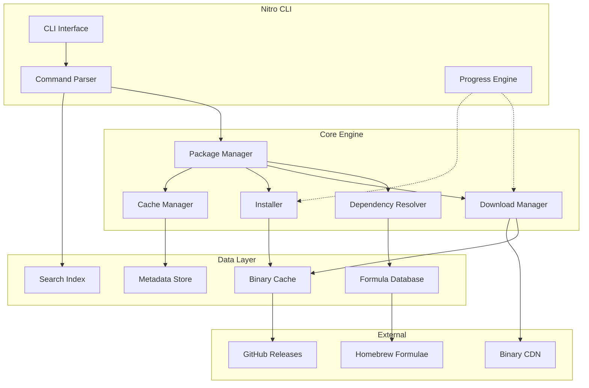
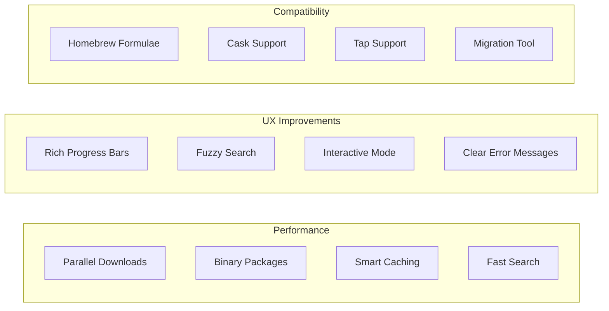
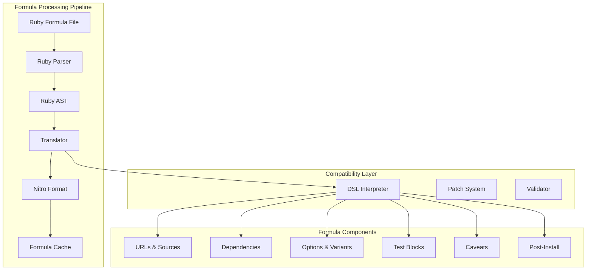
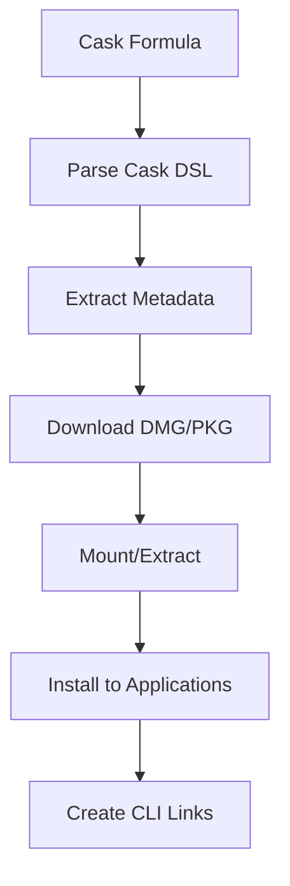

# Nitro Package Manager - Technical Plan

## Overview
Nitro is a high-performance package manager written in Rust that leverages Homebrew's formulae while providing significant performance improvements through parallel operations, intelligent caching, and pre-built binaries.

## Architecture



## Core Components

1. **Formula Parser**
   - Parse Homebrew formulae (Ruby DSL)
   - Convert to Nitro's internal format
   - Cache parsed results

2. **Dependency Resolver**
   - Parallel dependency graph construction
   - Conflict detection
   - Version constraint solving

3. **Download Manager**
   - Concurrent downloads with resumption
   - Binary package preference
   - Fallback to source compilation
   - Delta updates for large packages

4. **Installation Engine**
   - Parallel installation where possible
   - Atomic operations with rollback
   - Symlink management
   - Post-install scripts

5. **Cache System**
   - Multi-level caching (memory/disk)
   - Binary package cache
   - Formula metadata cache
   - Download cache with integrity checks

## Key Features



## Implementation Phases

**Phase 1: Core Foundation**
- Basic CLI structure
- Formula parser for Homebrew compatibility
- Simple package installation
- Local package database

**Phase 2: Performance**
- Parallel download system
- Binary package support
- Intelligent caching
- Dependency resolver optimization

**Phase 3: UX Enhancement**
- Rich terminal UI with progress visualization
- Fuzzy search implementation
- Interactive package selection
- Improved error handling

**Phase 4: Advanced Features**
- Delta updates
- Package signing/verification
- Custom binary CDN
- LLM integration for search

## Technical Stack

**Core Dependencies:**
- `clap` - CLI argument parsing
- `tokio` - Async runtime
- `reqwest` - HTTP client
- `indicatif` - Progress bars
- `tantivy` - Full-text search
- `sled` - Embedded database
- `serde` - Serialization

**Project Structure:**
```
nitro/
├── Cargo.toml
├── src/
│   ├── main.rs
│   ├── cli/
│   ├── core/
│   │   ├── package.rs
│   │   ├── formula.rs
│   │   ├── resolver.rs
│   │   └── installer.rs
│   ├── download/
│   ├── cache/
│   ├── search/
│   └── ui/
├── tests/
└── docs/
```

## Homebrew Formula Compatibility Strategy

### Formula Parser Architecture



### Homebrew DSL Support

**Core Formula Elements:**
```ruby
# Homebrew formula example
class Wget < Formula
  desc "Internet file retriever"
  homepage "https://www.gnu.org/software/wget/"
  url "https://ftp.gnu.org/gnu/wget/wget-1.24.5.tar.gz"
  sha256 "..."
  
  depends_on "pkg-config" => :build
  depends_on "openssl@3"
  
  def install
    system "./configure", "--prefix=#{prefix}"
    system "make", "install"
  end
  
  test do
    system bin/"wget", "-O", "/dev/null", "https://google.com"
  end
end
```

**Nitro Translation:**
```rust
// Internal representation
struct NitroFormula {
    name: String,
    desc: String,
    homepage: String,
    sources: Vec<Source>,
    dependencies: DependencyGraph,
    install_script: InstallScript,
    test_script: Option<TestScript>,
    binary_packages: Vec<BinaryPackage>, // Nitro enhancement
}
```

### Compatibility Features

1. **Formula Discovery**
   ```mermaid
   graph LR
       TAP[Homebrew Taps] --> SYNC[Tap Sync]
       SYNC --> INDEX[Formula Index]
       INDEX --> SEARCH[Search API]
       LOCAL[Local Formulae] --> INDEX
   ```

2. **DSL Feature Support**
   - **Supported:**
     - Basic attributes (desc, homepage, version)
     - Source URLs with mirrors
     - SHA256 verification
     - Dependencies (build, runtime, optional)
     - Install blocks
     - Test blocks
     - Caveats
     - Options and variants
     - Patches
     - Resources
   
   - **Enhanced:**
     - Binary package hints
     - Parallel build flags
     - Cache directives
     - Platform-specific optimizations

3. **Tap Compatibility**
   ```
   nitro tap add homebrew/core
   nitro tap add homebrew/cask
   nitro tap add custom/tap https://github.com/user/tap
   ```

### Migration Strategy

**1. Formula Import Process:**
```rust
// Pseudo-code for formula import
async fn import_formula(formula_path: &Path) -> Result<NitroFormula> {
    let ruby_content = read_file(formula_path)?;
    let ast = parse_ruby_dsl(&ruby_content)?;
    let formula = translate_to_nitro(ast)?;
    
    // Enhance with Nitro features
    formula.binary_packages = find_binary_packages(&formula).await?;
    formula.parallel_safe = analyze_build_safety(&formula);
    
    Ok(formula)
}
```

**2. Compatibility Database:**
```sql
-- Track formula compatibility
CREATE TABLE formula_compat (
    name TEXT PRIMARY KEY,
    homebrew_version TEXT,
    nitro_version TEXT,
    compatibility_level TEXT, -- full, partial, requires_patch
    notes TEXT
);
```

**3. Runtime Translation:**
- On-demand formula parsing
- Cached translations
- Automatic updates when formulae change

### Cask Support



### Gradual Enhancement Strategy

**Phase 1: Direct Compatibility**
- Parse and execute formulae as-is
- No modifications to build process
- Full compatibility baseline

**Phase 2: Binary Shortcuts**
- Detect formulae with available binaries
- Skip compilation when possible
- Maintain source fallback

**Phase 3: Formula Enhancement**
- Add Nitro-specific metadata
- Optimize build flags
- Parallel installation hints

**Phase 4: Native Formulae**
- Nitro-optimized formula format
- Backward compatibility layer
- Community formula contributions

### Example: Enhanced Formula

```toml
# nitro-formula.toml (future native format)
[package]
name = "wget"
version = "1.24.5"
description = "Internet file retriever"

[sources]
primary = "https://ftp.gnu.org/gnu/wget/wget-1.24.5.tar.gz"
sha256 = "..."

[binaries.macos-arm64]
url = "https://nitro-cdn.example.com/wget-1.24.5-macos-arm64.tar.gz"
sha256 = "..."

[binaries.linux-x64]
url = "https://nitro-cdn.example.com/wget-1.24.5-linux-x64.tar.gz"
sha256 = "..."

[dependencies]
build = ["pkg-config"]
runtime = ["openssl@3"]

[build]
parallel = true
script = """
./configure --prefix=$PREFIX
make -j$JOBS
make install
"""
```

## Performance Goals
- 10x faster package installation through binaries
- 5x faster dependency resolution
- Near-instant package search
- < 100ms CLI startup time

## Future Enhancements
- Local LLM integration for intelligent package discovery
- Delta updates for efficient package upgrades
- Custom binary CDN for optimal download speeds
- Advanced caching strategies for improved performance